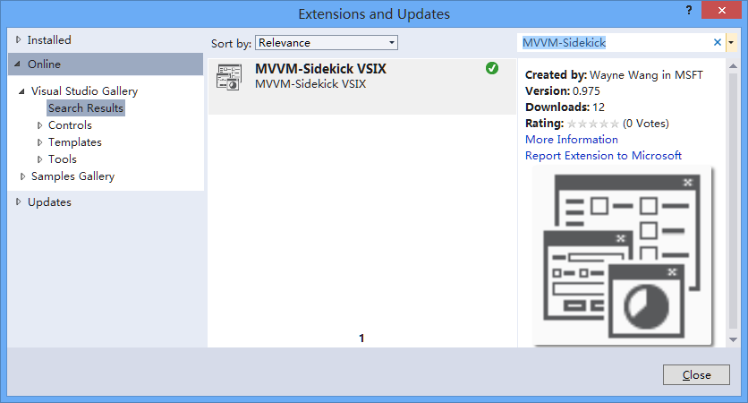
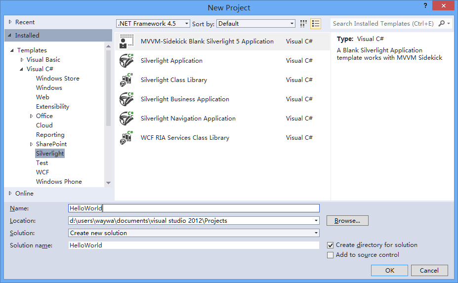
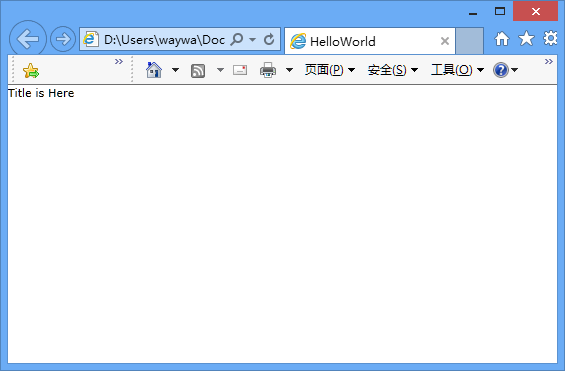

#Hello World! I am MVVM-Sidekick
> #跟班儿问世篇

##1.  Install VS Extension.
>##1.  安装模板包

MVVM-Sidekick VS Extension only supports VS2012 at the moment.
>MVVM跟班儿的VS扩展目前只支持VS2012.

You can downloaded here.
>你可以再此下载

[http://visualstudiogallery.msdn.microsoft.com/ef9b45cb-8f54-481a-b248-d5ad359ec407](http://visualstudiogallery.msdn.microsoft.com/ef9b45cb-8f54-481a-b248-d5ad359ec407 "http://visualstudiogallery.msdn.microsoft.com/ef9b45cb-8f54-481a-b248-d5ad359ec407")

If the link is outdated,  try search 'MVVM-Sidekick' on your VS2012's 'Extensions and Updates' manager (TOOLS MENU).

> 如果链接失效,请尝试在你的VS2012工具菜单下的"扩展与更新"管理器中搜索"MVVM-Sidekick".

##2.  Create a new MVVM-Sidekick Project
>##2.   创建新跟班儿项目

After you install the VS extension, you can create a new MVVM-Sidekick project.
>安装过了模板扩展，你就可以创建新工程了

Now we support WP8, Silverlight 5, WPF 4.5 ,Windows Store platforms.
>现在跟班儿支持  WP8, Silverlight 5, WPF 4.5 ,Windows Store 平台.

You can find our Project Template in each catolog we supported.
>在各个支持平台的分类中 你可以找到MVVM-Sidekick工程

And you can search 'MVVM' on the top-left Textbox.
>你也可以在右上角搜索MVVM

After you create this project, press F5, if your template works well, you may meet your Mainpage.

## 3. 
