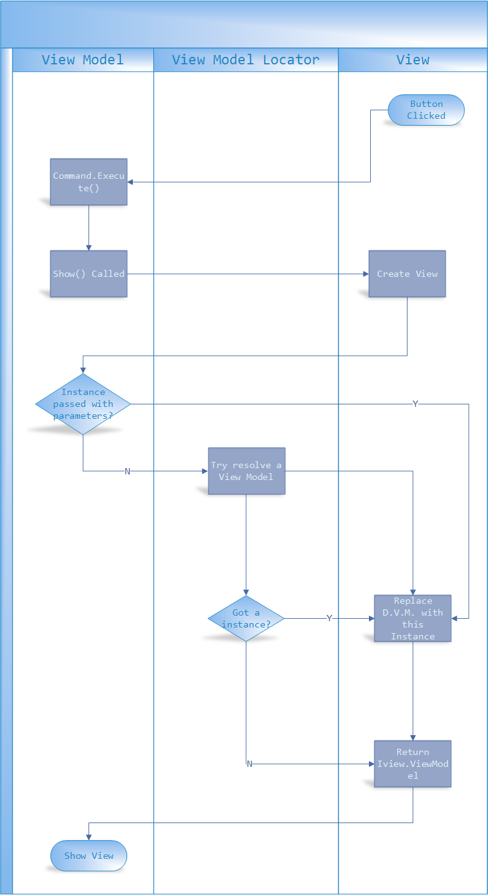

 ***Warning: If you are developing WPF4 application, you need VS2012 with Update 3 or later installed， or a clean Vs2012 without any Update (not recommended)***
> 
> ***注意：如果您要开发WPF4程序，您需要安装 VS2012 Update 3 以上的版本， 或者卸载所有Update(不推荐)***
 
 
 ------------------
#MVVM-Sidekick View Model (Part 2)

##2.View Model Life time

###2.1 Ways to create View Models.


### 2.1.1 Created in View  (Default View Model  a.k.a. D.V.M.)

In MVVM-Sidekick View, you can find a xaml fragment like this.

``` xml

	<mvvm:MVVMControl
	    xmlns="http://schemas.microsoft.com/winfx/2006/xaml/presentation"
	    xmlns:x="http://schemas.microsoft.com/winfx/2006/xaml"
	    xmlns:d="http://schemas.microsoft.com/expression/blend/2008"
	    xmlns:mc="http://schemas.openxmlformats.org/markup-compatibility/2006"
	    xmlns:sdk="http://schemas.microsoft.com/winfx/2006/xaml/presentation/sdk" x:Class="Samples.MainPage"
	    mc:Ignorable="d"
	    d:DesignHeight="600" d:DesignWidth="800"
	    xmlns:vm="clr-namespace:Samples.ViewModels" 
	    xmlns:mvvm="clr-namespace:MVVMSidekick.Views;assembly=MVVMSidekick_Sl">

	    <mvvm:MVVMControl.Resources>
	        <vm:Index_Model x:Key="DesignVM" />
	    </mvvm:MVVMControl.Resources>

    	<Grid x:Name="LayoutRoot" Background="White" DataContext="{StaticResource DesignVM}" ShowGridLines="True" >
 		......
	
```

You can find `<vm:[ViewName]_Model x:Key="DesignVM" />` in every view created by MVVM-Sidekick Item Templates. 

These announcements should be translate to a new instance of `[ViewName]_Model`, and these instances will be bind to first `ContentControl`'s `DataContext` property of each view:


``` xml

		<Grid x:Name="LayoutRoot" Background="White" DataContext="{StaticResource DesignVM}" ShowGridLines="True" />
 
```

#### 2.1.1.1 Why MVVM-Sidekick creates a Default View Model instance in every View's XAML ?

Reason:The Default View Model (aka D.V.M.) is necessary.

In common MVVM develop circle

1. A Use Case is confirmed:
2. The Use Case should be translated to View Model Contract(VM that with properties and commands, without functional implements, nor data) by *Model Designer role*.
3. and the View Model Contract should be delivered to both *UI Design role* and *Logic Implement role*.
4. Both teams develop 
5. *UI Design role* design and test UI with Dummy Data in View Model, *Logic Implement role* develop and test View Model with Mock and Unit Test tool.
6. Both team submit code together and Debug/Test.


During step 4, *UI Design role* is quite difficult to design view's XAML binding and behaviors without dummy data. 

***In the WPF/Silverlight age***, *Expression Blend 4* supports `XML Data Sources` for dummy data. The data structure of `XML Data Sources` is kind of weak typed and lack of command support. It is not widely used, cos it did not bring as much productivity as it should.

In D.V.M. instance, you can place Design Dummy data and logic only affected in design time.  

Using `ViewModelBase.IsInDesignMode` property, your code may find out it is in run-time or design-time with current context. For example:

``` csharp

    protected override async Task OnBindedViewLoad(MVVMSidekick.Views.IView view)
        {
            await base.OnBindedViewLoad(view);

            if (IsInDesignMode)
            {
                HelloWorld = "Hello Mvvm world, Design mode sample";
            }
            else
            {
                GetValueContainer(x => x.CountDown).GetNullObservable()
                    .Subscribe(
                        _ =>
                        {
                            HelloWorld = string.Format("Loading {0}", CountDown);
                        }
                    );
            }

        }

``` 


In this method, if the D.V.M. is created in a designer view, the `HelloWorld` property value would be "Hello Mvvm world, Design mode sample", in which case in designer you can bind the value to `TextBlock` and get the direct vision of this binding. 

``` xml

	<TextBlock Text="{Binding HelloWorld}" Grid.RowSpan="2" Grid.ColumnSpan="4"  />

``` 


You can create dummy data factory logic there too.

*UI Design role* loves this.

#### 2.1.1.2 Why do MVVM-Views not use View's `DataContext` property hold View Model ? Why use first child  `ContentControl`'s `DataContext` property ?

View's `DataContext` value can be inherited from parent elements. We should give property inheritance a chance to deliver value into view.

Actually almost every view logic happened in the root `Grid`  or `Canvas`. It is natural to place our View Model here.

#### 2.1.1.3 Is D.V.M. for design-time Only?

If a view model parameter is not applied when calling `Stage.Show()`, and a default factory/instance is not registered in start up class, the D.V.M would be the in-charge view model of this view.


### 2.1.2 Registered Instance or Factory in service locator (Registered View Model a.k.a. R.V.M.)

If we have a template/factory or we need singleton instance of certain View Model Type, we can configure this though start up class of your app.

In Hello world chapter, we created a view by add `MVVM-Sidekick View` in Visual Studio. When a view is added to your project, these items is actually added at the mean time:

- View.Xaml
- View.Xaml.cs
- View_Model.cs (In `ViewModels` folder)
- View.cs (in `Startups` folder)

The cs file in `Startups` folder is the basic mapping configure of this view. It maps `View` Type with `View_Model` Type and also offer how to create or locate a default instance of View Model.  

For example:

``` csharp

  	public static partial class StartupFunctions
    {
        public static void ConfigGroupViewSample()
        {
            ViewModelLocator<GroupViewSample_Model>
                .Instance
                .Register(new GroupViewSample_Model()) 'Singleton instance
                .GetViewMapper()
                .MapToDefault<GroupViewSample>();

            ViewModelLocator<GroupViewSample_Model>
                .Instance
                .Register("NewInstanceVM", o => new GroupViewSample_Model() { Title = "NewInstance" }, true) 'Named factory
                .GetViewMapper()
                .MapToDefault<GroupViewSample>("NewInstanceVW"); 'Named View Mapping

        }
    }

```

In this function you can change `.Register(new GroupViewSample_Model())` to a factory with  IOC　component visit. 
you can also configure more mappings with different View Model factory to view, and named them freely. 

When you want use these mappings, you can use the `Stage.Show()` method with a view mapping key, or use default value.


### 2.1.3 Created in code. (Code View Model a.k.a. C.V.M)

In view model logic, when a command is invoked by UI, a new view model might be created for the new view navigating into. The `Stage.Show()` method would use this new instance replace either the D.V.M. instance or R.V.M.

Here is an example:

``` csharp

  	public CommandModel CommandShowGroupView
        {
            get { return _CommandShowGroupViewLocator(this).Value; }
            set { _CommandShowGroupViewLocator(this).SetValueAndTryNotify(value); }
        }
        #region Property CommandModel CommandShowGroupView Setup
		//blah blah definations
		static Func<BindableBase, CommandModel> _CommandShowGroupViewDefaultValueFactory =
            model =>
            {
                var cmd = new ReactiveCommand(canExecute: true) { ViewModel = model }; //New Command Core
                //Config it if you want
                var vm = CastToCurrentType(model); //vm instance 
                cmd.Subscribe(
                  async _ =>
                  {
                      var targetvm = new GroupViewSample_Model();  //New VM
                      targetvm.InitData(CollectionViewType.Grouped); //Init VM data
                      await vm.StageManager.DefaultStage.Show<GroupViewSample_Model>(targetvm); //Show with this VM.
                  })
                  .DisposeWith(vm);
                return cmd.CreateCommandModel("ShowGroupView");
            };
        #endregion

```

###2.1.4 Which one in charge?

- If you passed a C.V.M. instance to  `Stage.Show()`， C.V.M. will take charge.
- If you have no C.V.M. (null), the R.V.M. would be used.
- If There is no R.V.M. registered (or it is a null reference), D.V.M. will remain in charge.




You can use code below to get V.M. in charge after `Stage.Show()`.

``` csharp

  			async _ =>
                  {
                      var targetvm = new GroupViewSample_Model();
                      targetvm.InitData(CollectionViewType.Grouped);
                      var executeContext = await vm.StageManager.DefaultStage.ShowAndGetViewModel<GroupViewSample_Model>(targetvm);
                      var vmInCharge = executeContext.ViewModel;
                      await executeContext.Closing;
                  }
```


## 2.2 Disposing View Models


### 2.2.1 Why View Model implements `IDisposable` Interface

In popular MVVM design, View Model is a  context container, an intersection center between UI and Services.

- Fact: View Model holds resources that should release after It finished it's job. These 
	- Web/WCF Service Proxies
	- DBMS Connections
	- Opend IO Stream
	- Memory allocation


- Fact: View Model brings Subscriptions and other actions need be done when it's done
	- Event handlers' -= actions 	 
 	- Reactive extension's Subscriptions
 	- Thread blocking locks and task blocking callbacks.

So we MUST provide a facility of `IDisposable`.
 


### 2.2.2 What does a View Model do In it's `Dispose()` method?

When developer wanna add a dispose object or a dispose action, these methods are used:

``` csharp

            /// <summary>
            /// <para>Register logic actions need to be executed when the instance is disposing</para>
            /// <para>注册一个销毁对象时需要执行的操作</para>
            /// </summary>
            /// <param name="newAction">Disposing action/销毁操作</param>
            public void AddDisposeAction(Action newAction, string comment = "", [CallerMemberName] string caller = "", [CallerFilePath] string file = "", [CallerLineNumber]int line = -1)
            {

                var di = new DisposeInfo
                {
                    Caller = caller,
                    Comment = comment,
                    File = file,
                    Line = line,
                    Action = newAction

                };
                _locateDisposeInfos(this).Add(di);

            }


            /// <summary>
            /// <para>Register an object that need to be disposed when the instance is disposing</para>
            /// <para>销毁对象时 需要一起销毁的对象</para>
            /// </summary>
            /// <param name="item">disposable object/需要一起销毁的对象</param>
            public void AddDisposable(IDisposable item, string comment = "", [CallerMemberName] string caller = "", [CallerFilePath] string file = "", [CallerLineNumber] int line = -1)
            {
                AddDisposeAction(() => item.Dispose(), comment, caller, file, line);
            }

			// Extension Method
            /// <summary>
            /// <para>Add Idisposeable to model's despose action list</para>
            /// <para>将IDisposable 对象注册到VM中的销毁对象列表。</para>
            /// </summary>
            /// <typeparam name="T">Type of Model /Model的类型</typeparam>
            /// <param name="item">IDisposable Inastance/IDisposable实例</param>
            /// <param name="vm">Model instance /Model 实例</param>
            /// <returns></returns>
            public static T DisposeWith<T>(this T item, IBindable vm, string comment = "", [CallerMemberName] string caller = "", [CallerFilePath] string file = "", [CallerLineNumber] int line = -1) where T : IDisposable
            {
                vm.AddDisposable(item, comment, caller, file, line);
                return item;
            }
```


Usually `IDisposable` are warpped to a dispose action, and then dispose actions are wrapped as `DisposeInfo`. In `DisposeInfo`, more information like `CallerLineNumber` is stored .  

There is a `List<DisposeInfo>` in the instance of View Model.`_locateDisposeInfos(this).Add(di);` put newly warpped `DisposeInfo` to that list, and everything in that list would be invoked when `Dispose()` method is executed. 

``` csharp

       		/// <summary>
            /// <para>Do all the dispose </para>
            /// <para>销毁，尝试运行所有注册的销毁操作</para>
            /// </summary>
            public void Dispose()
            {
                if (Interlocked.Exchange(ref disposedFlag, 1) == 0)
                {
                    if (_disposeInfos != null)
                    {
                        var l = _disposeInfos.ToList ()
                            .Select
                            (
                                info =>
                                {
                                    //Exception gotex = null;
                                    try
                                    {
                                        info.Action();
                                    }
                                    catch (Exception ex)
                                    {
                                        info.Exception = ex;
                                    }
                                    return info;
                                }
                            )
                            .Where(x => x.Exception != null)
                            .ToArray();
                        if (l.Length > 0)
                        {
                            OnDisposeExceptions(l);
                        }
                    }

                    _disposeInfos = null;
                    GC.SuppressFinalize(this);
                }
            }


```

if any exception happens, the Dispose shall not stop. The exceptions  are collected to a new list and raise to `OnDisposeExceptions` method. 


### 2.2.3 What will happen if a View Model is not disposed by code?

We got a finalizer in View Model

``` csharp

     		~BindableBase()
            {
                Dispose();
            }

```

And let's check the main flow of `Dispose()` Method

``` csharp


       		/// <summary>
            /// <para>Do all the dispose </para>
            /// <para>销毁，尝试运行所有注册的销毁操作</para>
            /// </summary>
            public void Dispose()
            {
                if (Interlocked.Exchange(ref disposedFlag, 1) == 0)
                {
                    if (_disposeInfos != null)
                    {

						'Blah Blah
                    }

                   
                    GC.SuppressFinalize(this);
                }
            }

```

If you don't dispose in code, a GC garbage View Model instance would be finalized. 
`if (Interlocked.Exchange(ref disposedFlag, 1) == 0)` makes sure the logic only run once. 


### 2.2.4 How to: Add a disposable object disposing with View Model ?

As we've shown above, we got Extension Method `DisposeWith()`  to help us quickly add a `IDisposable` instance dispose with our View Model together.

Rx subscription is a `IDisposable` Instance returned by `Subscribe()`, so here is a example:

``` csharp

            this.CommandInputNumber
                .CommandCore
                .Where(e => e.EventArgs.Parameter.ToString() == ".")
                .Subscribe(e => IsPointed = true)
                .DisposeWith(this);

```


### 2.2.5 How to: Dispose a View Model after a View is closed.
``` csharp

            cmd.Subscribe(
              async _ =>
              {
                  using (var targetvm = new GroupViewSample_Model())
                  {
                      targetvm.InitData(CollectionViewType.Grouped);
                      await vm.StageManager.DefaultStage.Show<GroupViewSample_Model>(targetvm);

                  }
              })

```

