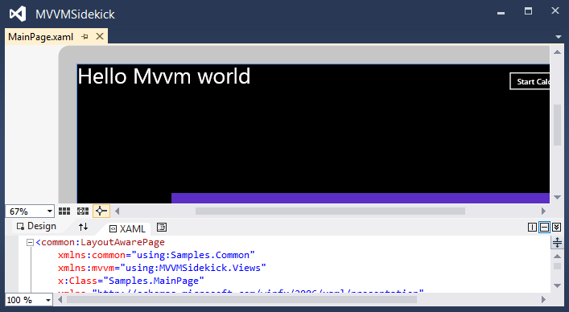

 ***Warning: If you are developing WPF4 application, you need VS2012 with Update 3 or later installed， or a clean Vs2012 without any Update (not recommended)***
> 
> ***注意：如果您要开发WPF4程序，您需要安装 VS2012 Update 3 以上的版本， 或者卸载所有Update(不推荐)***
 
 
 ------------------
#MVVM-Sidekick View Model (Part 2)

##2.View Model Life time

###2.1 Ways to create View Models.


### 2.1.1 Created in View  (Default View Model  aka. D.V.M.)

In MVVM-Sidekick View, you can find a xaml fragment like this.

``` xml

	<mvvm:MVVMControl
    xmlns="http://schemas.microsoft.com/winfx/2006/xaml/presentation"
    xmlns:x="http://schemas.microsoft.com/winfx/2006/xaml"
    xmlns:d="http://schemas.microsoft.com/expression/blend/2008"
    xmlns:mc="http://schemas.openxmlformats.org/markup-compatibility/2006"
    xmlns:sdk="http://schemas.microsoft.com/winfx/2006/xaml/presentation/sdk" x:Class="Samples.MainPage"
    mc:Ignorable="d"
    d:DesignHeight="600" d:DesignWidth="800"
    xmlns:vm="clr-namespace:Samples.ViewModels" 
    xmlns:mvvm="clr-namespace:MVVMSidekick.Views;assembly=MVVMSidekick_Sl">
    <mvvm:MVVMControl.Resources>
        <vm:Index_Model x:Key="DesignVM" />
    </mvvm:MVVMControl.Resources>

    <Grid x:Name="LayoutRoot" Background="White" DataContext="{StaticResource DesignVM}" ShowGridLines="True" >
	
```

You can find `<vm:[ViewName]_Model x:Key="DesignVM" />` in every view created by MVVM-Sidekick Item Templates. 

These announcements should be translate to a new instance of `[ViewName]_Model`, and these instances will be bind to first `ContentControl`'s `DataContext` property of each view:


``` xml

	<Grid x:Name="LayoutRoot" Background="White" DataContext="{StaticResource DesignVM}"* ShowGridLines="True" />
 
```

#### 2.1.1.1 Why create a View Model instance in View's XAML ?

The Default View Model (D.V.M.) is necessary in design time.

In common MVVM develop circle

1. A Use Case is confirmed:
2. The Use Case should be translated to View Model Contract(VM that with properties and commands, without functional implements, nor data) by model designer role.
3. and the View Model Contract should be delivered to both UI Design role and Logic Implement role.
4. Both teams develop 
5. UI Design role design and test UI with Dummy Data in View Model, Logic Implement role develop and test VM with Mock and Unit Test tool.
6. Both team submit code together and Debug/Test.


In step 4, UI role is quite difficult to design view's XAML binding and behaviors without dummy data. In old time expression blend support xml data soures but the structure is kind of weak typed and have no command support on that. It is not popular, cos it did not bring as much productivity as it should.


In the  D.V.M. instance that MVVM-Sidekick Views created bu default, you can place Design Dummy data and logic only affected in design time.  You can use `ViewModelBase.IsInDesignMode` property find out it is in run-time or design-time in current context. For example:

``` csharp

    protected override async Task OnBindedViewLoad(MVVMSidekick.Views.IView view)
        {
            await base.OnBindedViewLoad(view);

            if (IsInDesignMode)
            {
                HelloWorld = "Hello Mvvm world, Design mode sample";
            }
            else
            {
                GetValueContainer(x => x.CountDown).GetNullObservable()
                    .Subscribe(
                        _ =>
                        {
                            HelloWorld = string.Format("Loading {0}", CountDown);
                        }
                    );
            }

        }

``` 


In this override method, if the D.V.M. is created in a designer view, the `HelloWorld` property value would be "Hello Mvvm world, Design mode sample", in which case in designer you can bind the value to `TextBlock` and get the direct vision of this binding. 

``` xml

	<TextBlock Text="{Binding HelloWorld}" Grid.RowSpan="2" Grid.ColumnSpan="4"  />

``` 



You can create dummy data too.

Designer role loves this.

#### 2.1.1.2 Why not use View's `DataContext` property hold View Model ? Why use first `ContentControl`'s `DataContext`?

`DataContext` value can be inherited from parent elements. We should give property inherit a chance to deliver value into view.

Actually almost every view logic happened in the root `Grid`  or `Canvas`. It is natural to place our View Model here.

#### 2.1.1.3 Is D.V.M. just for design-time ?

When `Stage.Show()` method, if a view model parameter is not applied, and a default factory/instance is not registered, the D.V.M would be the in-charge view model of this view.
 


### 2.1.2 Created in code.

Building in progress...

### 2.1.3 Registered in locator.

Building in progress...
