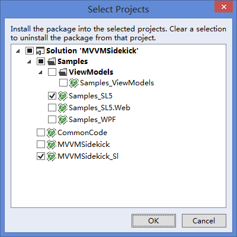
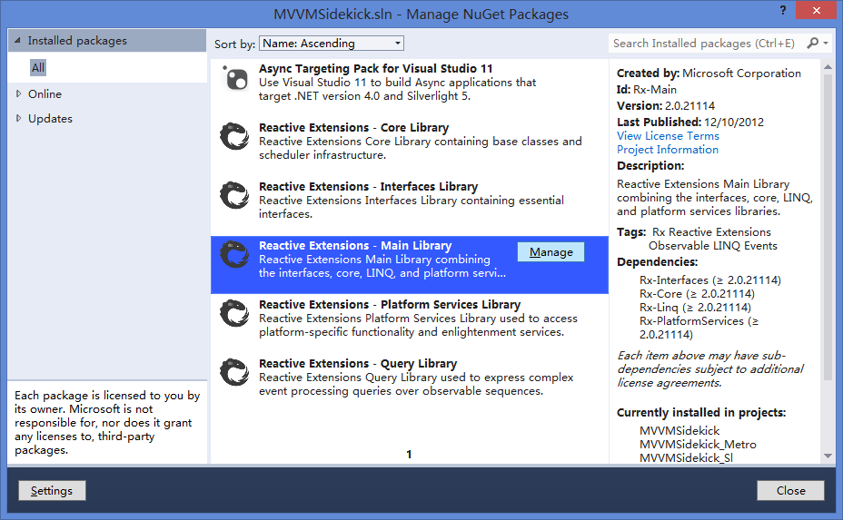

#Create a Caculator with MVVM-Sidekick Code File From nothing#
>#从0开始,使用纯代码的MVVM-Sidekick建立一个计算器#

*Like JS frameworks,it is kinda cool to  have no dlls but framework code files in your project, cos if you guys wanna change anything you can do it in code immediatly, without compile and depoly,reference refreshment stuff. We provide a single code file for all platforms, easy to install and uninstall, just add it or delete in your projects.(Of course we provide nuget dll reference package too. )*

>*和JS框架类似，作为一个前端框架，如果能够直接以代码文件而不是Dll引用的方式直接加入工程是挺酷的一件事。如果你有啥东东想要修改，直接在工程里改就齐了，不必开工程编译啊发布啊刷新引用啊，那么麻烦。我们提供了一个单独代码文件，直接将其加入你的工程就算安装了框架，删除了就算卸载，管理简单。(当然也有nuget的dll 引用 package)*

## Very first step: Create a empty project  ##
>## 千里跬步: 创建工程 ##

### 1 .Create a project of your target platform, add basic references, and set Conditional compilation symbols.###

>###1 . 创建一个目标工程，添加基础引用，在工程中设置条件编译符号。###

*MVVM-Sidekick now supports Silverlight 5, Windows Phone 8, WPF 4.5, and Windows Runtime XAML. We only support C Sharp offically, but it is not that hard to intergrade to VB.*
>*MVVM-Sidekick 现在支持的平台包括 Sliverlight 5, Windows Phone 8, WPF 4.5, 以及Windows Runtime Xaml程序。我们官方仅仅支持CSharp使用，但是根据我们的支持集成到VB也绝非难事*

<table border="3" align="center">
<thead><td>Platform/平台 </td><td>Basic References/基础引用</td><td>Symbol/符号</td></thead>
<tr><td>Silverlight 5</td><td>
System.Runtime.Serialization 
Microsoft.CSharp 
System.Windows.Controls.Navigation
</td><td>SILVERLIGHT_5</td></tr>
<tr><td>WPF 4.5</td><td>System.Runtime.Serialization </td><td>WPF</td></tr>
<tr><td>Windows Phone 8</td><td>System.Runtime.Serialization </td><td>WINDOWS_PHONE_8</td></tr>
<tr><td>Windows RT XAML</td><td>-</td><td>NETCORE_FX</td></tr>
</table>

Figure 1
  Input conditional compilation symbols <HERE> 
在<这里>输入条件编译符号

###2 . [SL5] Add async await support to your project###

>###2 . [SL5] 为工程添加 async await 关键字支持###

*In Silverlight 5 projects and Wpf 4.0,  async await key words are not supported by default because awaitable TPL class are newly added since .net 4.5. You can add support in vs2012 by nuget, instead.*
>*在 Silverlight 5 或者 Wpf 4.0工程里, VS并不默认支持 async await 关键字，这是因为TPL的awaitable 类型支持是在.net 4.5新加入的. 作为替代，你可以用nuget来为你的SL5工程添加这种支持.*

**Open :`VS Menu-> TOOLS->Libary Package Manager ->Manage Nuget Packages For Solution`**

**Search & Install:`Online:Microsoft.CompilerService.Async`**

**Click Manage :`Installed packages, All:Microsoft.CompilerService.Async`**

 
Figure 2. Add nuget package, 

 
Figure 3. Target project of async support.

###3 .  Add RX to your project###

>###3 . 为工程添加 RX 支持###

**Open :`VS Menu-> TOOLS->Libary Package Manager ->Manage Nuget Packages For Solution`**

**Search & Install:`Online:Rx-Main`**

**Click Manage :`Installed packages, All: Rx-Main`**

 
Figure 4. Add nuget package, Rx-Main

 
Figure 5. Target projects of Rx .

###4 .  Add MVVM.cs To your project.###

>###4 . 为工程添加 MVVM.cs ###

**Open :`VS Menu-> PROJECT->Add Existing Item ->MVVM.cs(Add as Link)`**
###5 .  Try Build your Project.###

>###5 . 尝试编译你的项目 ###

